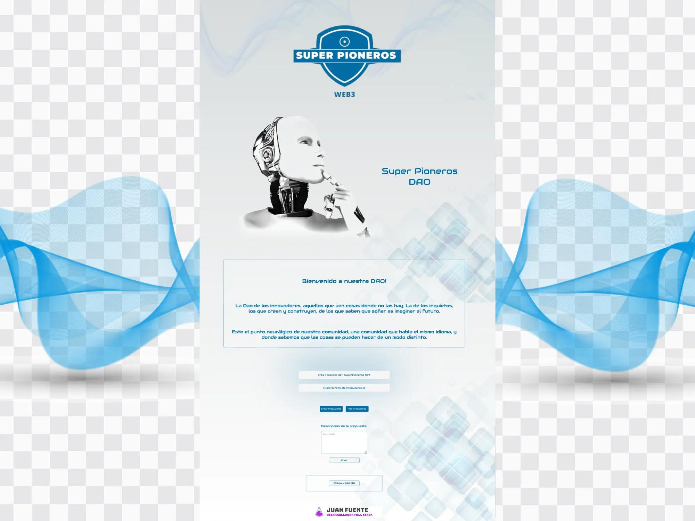
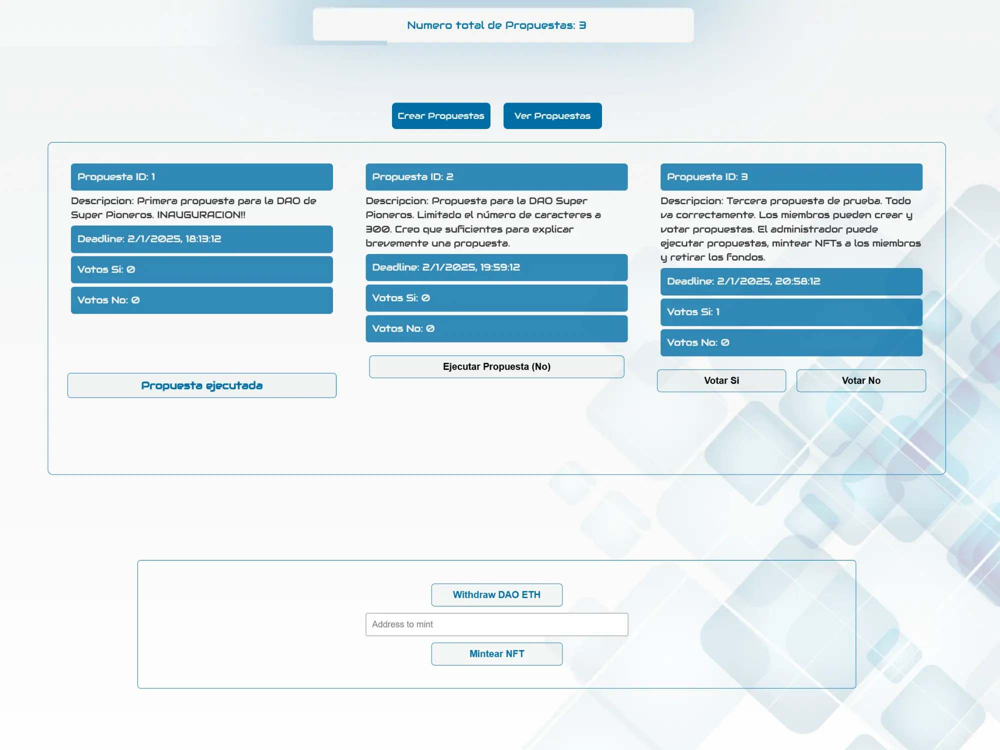
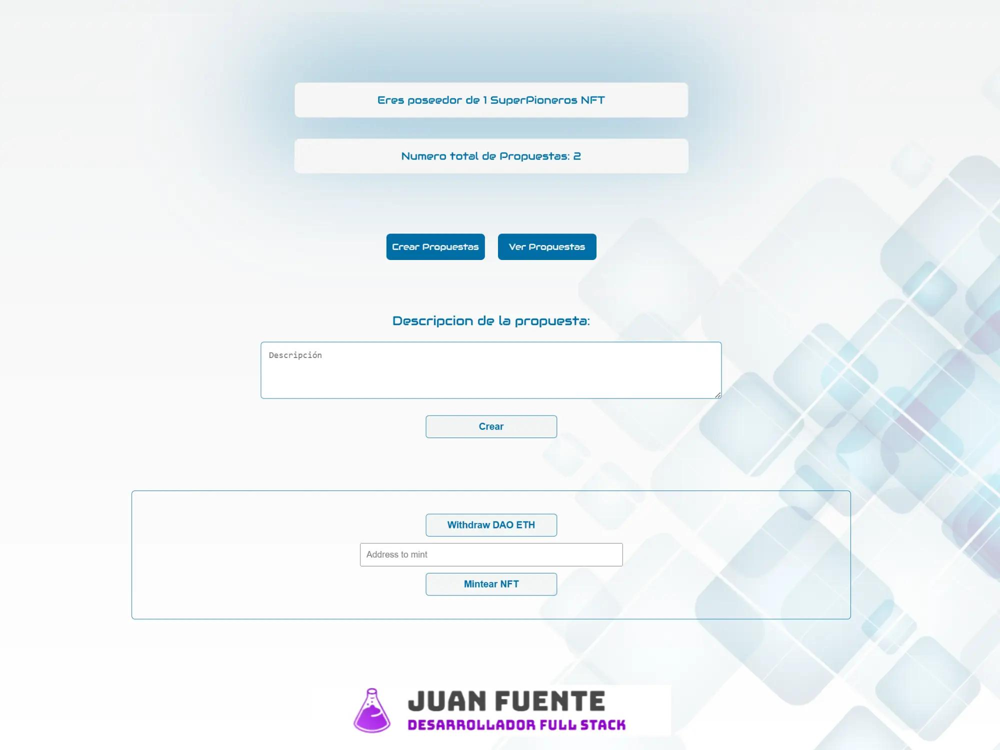

# SuperPioneros DAO - DApp de Gobernanza Comunitaria 🏛️

## Descripción Breve

Una Aplicación Descentralizada (DApp) que implementa una **Organización Autónoma Descentralizada (DAO)** básica para la gestión y toma de decisiones de la comunidad "Innovadores Super Pioneros". Construida sobre **Ethereum (Sepolia Testnet)**, permite a los miembros poseedores del token de gobernanza **crear propuestas y participar en votaciones on-chain**.



## Contexto y Propósito

Este proyecto se desarrolló como una herramienta práctica para explorar y aplicar conceptos de **gobernanza descentralizada** para una comunidad real. El objetivo es permitir una toma de decisiones más transparente y democrática entre los miembros mediante propuestas y votaciones registradas en la blockchain.

*Nota: La estructura toma base material de [Ethereum Developer Degree de LearnWeb3.io](https://learnweb3.io/degrees/ethereum-developer-degree/), adaptándolo y aplicando a las necesidades específicas de esta DAO.*

## Características Principales ✨

* **Creación de Propuestas:** Los miembros verificados (poseedores del token) pueden someter nuevas propuestas a la consideración de la DAO.
* **Sistema de Votación On-Chain:** Los miembros pueden votar "A favor" o "En contra" de las propuestas activas, quedando cada voto registrado de forma inmutable.
* **Token Gating:** La capacidad de crear propuestas y votar está restringida a las direcciones que poseen el token de gobernanza específico de la DAO.
* **Visualización de Gobernanza:** La interfaz muestra las propuestas activas, su estado (aprobada, rechazada, en curso), y los resultados de las votaciones.
* **Integración de Wallet Sencilla:** Utiliza **RainbowKit, Wagmi y Viem** para una conexión fluida y segura con múltiples tipos de wallets (Metamask, etc.).

## Tecnologías Utilizadas 🛠️

* **Smart Contracts:** Solidity
* **Frontend:** React, Next.js, JavaScript, CSS 
* **Librerías Web3 Frontend:** Wagmi, Viem, RainbowKit
* **Blockchain:** Ethereum (Sepolia Testnet)
* **Entorno de Desarrollo/Testing Contratos:** Hardhat, Remix
* **Herramientas:** Git, GitHub, npm/yarn

## Demo / Código Fuente 🔗

* **Repositorio GitHub:** `[https://github.com/Juan-Fuente-T/SuperPioneros_DAO]`

* **(Demo en vivo)** `[https://juanfuente.ovh/superpioneros_dao/]`

## Cómo Empezar (Desarrollo Local) 🚀

1.  **Prerrequisitos:**
    * Node.js, npm/yarn, Git
    * Wallet (Metamask).

2.  **Clonar Repositorio:**
    ```bash
    git clone https://github.com/Juan-Fuente-T/SuperPioneros_DAO.git
    cd SuperPioneros_DAO
    ```
3.  **Instalar Dependencias:**
    ```bash
    # Comando/s para instalar dependencias (frontend y contratos)
    npm install # O yarn install
    ```
 
4.  **Configurar Variables de Entorno:**
    * Crear archivo `.env`.
    * Añadir variables: `NEXT_PUBLIC_WALLET_CONNECT_ID` (conexión a RainbowKit). 
    * *Añadir `.env` a `.gitignore`.*

5.  **Iniciar Frontend:**
    ```bash
    # Comando para iniciar el frontend 
    np run dev
    ```
6.  Abrir `http://localhost:3000` (o puerto indicado).

## Uso Básico 🖱️

1.  Conecta tu wallet (Metamask) en Sepolia.
2.  Debes tener uno de tokens de gobernanza de la DAO SuperPioneros. 
3.  Explora las propuestas existentes.
4.  Si tienes permisos (tokens), usa el formulario para crear una nueva propuesta.
5.  Vota en las propuestas activas.

*(Añadir aquí 1-2 capturas clave: vista de propuestas, creación, votación)*





## Licencia 📄

MIT License. 

## Contacto 📬

Juan Fuente - [https://www.linkedin.com/in/juan-fuente-dev/] - [https://juanfuente.ovh] - jfuentet@gmail.com